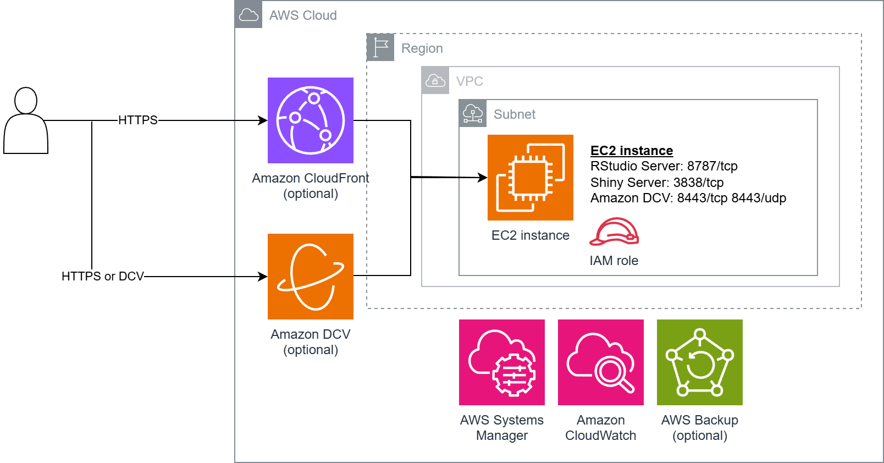

## R-Server

R and RStudio, Shiny and/or Positron on EC2

## Description

This solution provisions EC2 instance with [R](https://www.r-project.org/), and optionally [RStudio Server](https://posit.co/download/rstudio-server/), [Shiny Server](https://posit.co/download/shiny-server/) and both [RStudio Deskop](https://posit.co/products/open-source/rstudio) and [Positron](https://posit.co/products/ide/positron/) IDEs. The web and desktop applications can be accessed securely through [Amazon CloudFront](https://aws.amazon.com/cloudfront/) and [Amazon DCV](https://aws.amazon.com/hpc/dcv/) respectively. Template will install GPU driver and provide access to additional [NVIDIA software](https://repost.aws/articles/ARWGxLArMBQ4y1MKoSHTq3gQ/install-nvidia-gpu-driver-cuda-toolkit-nvidia-container-toolkit-on-amazon-ec2-instances-running-ubuntu-linux) if a [NVIDIA GPU instance](https://docs.aws.amazon.com/AWSEC2/latest/UserGuide/install-nvidia-driver.html#nvidia-driver-instance-type) is specified.

## Demo

Video showing [RStudio Desktop](https://posit.co/products/open-source/rstudio), [Positron](https://posit.co/products/ide/positron/), [Shiny Server](https://posit.co/products/open-source/shiny-server/), [RStudio Server](https://posit.co/download/rstudio-server/), and [Paws](https://www.paws-r-sdk.com/) library accessing [Amazon S3](https://aws.amazon.com/s3/)

<https://github.com/user-attachments/assets/c177342f-b87d-4451-b2f0-7e0e0200287b>

## Architecture Diagram

## Overview of features

The [CloudFormation](https://aws.amazon.com/cloudformation/) template provides the following features:

- [Ubuntu](https://ubuntu.com/aws) or [Ubuntu Pro](https://aws.amazon.com/about-aws/whats-new/2023/04/amazon-ec2-ubuntu-pro-subscription-model/) 24.04 LTS
  - [Docker Engine](https://docs.docker.com/engine/)
  - GPU driver and [NVIDIA Container Toolkit](https://docs.nvidia.com/datacenter/cloud-native/container-toolkit/latest/index.html) (NVIDIA [instance types](https://docs.aws.amazon.com/AWSEC2/latest/UserGuide/install-nvidia-driver.html#nvidia-driver-instance-type))
- R Applications
  - [R](https://www.r-project.org/) from [CRAN](https://cran.r-project.org/) (Comprehensive R Archive Network) project
    - [r2u](https://eddelbuettel.github.io/r2u/) (CRAN as Ubuntu Binaries) project with [bspm](https://cran4linux.github.io/bspm/) (Bridge to System Package Manager): `apt` integration for [fast](https://eddelbuettel.github.io/r2u/#brief-demo)  R package install
    - [Paws](https://www.paws-r-sdk.com/) (SDK for R): access to [AWS services](https://aws.amazon.com/blogs/opensource/getting-started-with-r-on-amazon-web-services/)
    - [reticulate](https://rstudio.github.io/reticulate/) (R interface to Python): interoperability between R and Python
    - [tidyverse](https://tidyverse.org/): simplify and streamline data science workflows
  - [RStudio Server](https://posit.co/download/rstudio-server/) (optional)
  - [RStudio Desktop](https://posit.co/products/open-source/rstudio) and [Positron](https://posit.co/products/ide/positron/) (optional)
  - [Shiny Server](https://posit.co/products/open-source/shiny-server/) (optional)
- AWS Applications
  - [Mountpoint for Amazon S3](https://aws.amazon.com/s3/features/mountpoint/): [mount](https://docs.aws.amazon.com/AmazonS3/latest/userguide/mountpoint.html) an [Amazon S3](https://aws.amazon.com/s3/) bucket as local file system
  - [AWS CLI](https://aws.amazon.com/cli/) with [partial mode](https://docs.aws.amazon.com/cli/latest/userguide/cli-usage-parameters-prompting.html#cli-usage-auto-prompt-modes) [auto-prompt](https://docs.aws.amazon.com/cli/latest/userguide/cli-usage-parameters-prompting.html)
- AWS Services
  - [Amazon CloudFront](https://aws.amazon.com/cloudfront/): secure web access to RStudio Server and Shiny Server (optional)
  - [Amazon DCV](https://aws.amazon.com/hpc/dcv/): secure high-performance remote graphical desktop access (optional)
  - [AWS Backup](https://aws.amazon.com/backup/): EC2 instance data protection (optional)
- Administration
  - [AWS Systems Manager Session Manager](https://docs.aws.amazon.com/systems-manager/latest/userguide/session-manager.html): browser-based terminal access
  - [EC2 Instance Connect](https://docs.aws.amazon.com/AWSEC2/latest/UserGuide/connect-linux-inst-eic.html): browser-based SSH (Linux)
  - [EC2 IAM role](https://docs.aws.amazon.com/AWSEC2/latest/UserGuide/iam-roles-for-amazon-ec2.html): access to AWS services

## License Agreement

Although this repository is released under the MIT-0 license, its CloudFormation template install third party components.
Usage indicate license agreement acceptance of all software that is installed on EC2 instance, which include (but is not limited to) the following

- R Project : [GPL-2 | GPL-3](https://www.r-project.org/Licenses/)
- r2u Project : [GPL (>=2)](https://github.com/eddelbuettel/r2u)
- RStudio Server : [AGPL v3](https://posit.co/products/open-source/rstudio-server/)
- RStudio Desktop : [AGPL v3](https://posit.co/products/open-source/rstudio)
- Shiny Server : [AGPL v3](https://posit.co/products/open-source/shiny-server/)
- Positron : [Elastic License 2.0](https://positron.posit.co/licensing.html)
- [Paws](https://github.com/paws-r/paws) package : [Apache 2.0](https://github.com/paws-r/paws/blob/main/LICENSE.txt)
- Amazon DCV : [DCV EULA](https://www.amazondcv.com/eula.html)

### About Posit Software

Template installs free versions of RStudio, Shiny Server and Positron, which are created by [Posit Software, PBC](https://posit.co/about/). Company offers [enterprise versions](https://posit.co/products/enterprise/workbench/) including [RStudio IDE integration](https://posit.co/use-cases/sagemaker/) with [Amazon SageMaker AI](https://docs.aws.amazon.com/sagemaker/latest/dg/rstudio.html)

## Other options

- [Amazon Lightsail for Research](https://aws.amazon.com/lightsail/research/) supports [RStudio Desktop](https://docs.aws.amazon.com/lightsail-for-research/latest/ug/tutorial-rstudio.html). Refer to [Getting started with Amazon Lightsail for Research: A tutorial using RStudio](https://aws.amazon.com/blogs/publicsector/getting-started-amazon-lightsail-research-tutorial-using-rstudio/) for more information
- Amazon SageMaker AI supports [notebook instance with R](https://docs.aws.amazon.com/sagemaker/latest/dg/r-sagemaker-get-started.html) and [RStudio](https://docs.aws.amazon.com/sagemaker/latest/dg/rstudio.html). Refer to blog post [Get started with RStudio on Amazon SageMaker](https://aws.amazon.com/blogs/machine-learning/get-started-with-rstudio-on-amazon-sagemaker/) for more information
- Blog post [Scaling RStudio/Shiny using Serverless Architecture and AWS Fargate](https://aws.amazon.com/blogs/architecture/scaling-rstudio-shiny-using-serverless-architecture-and-aws-fargate/) discuss a scalable, secure, and serverless architecture pattern to host RStudio Server

## Requirements

- EC2 instance must be provisioned in a subnet with outbound IPv4 internet connectivity.
- To use Amazon CloudFront, [VPC](https://docs.aws.amazon.com/vpc/latest/userguide/AmazonDNS-concepts.html#vpc-dns-support) attributes `enableDnsSupport` and `enableDnsHostnames` must be enabled

Above configuration are enabled in [default VPC](https://docs.aws.amazon.com/vpc/latest/userguide/default-vpc.html)

## Deploying using CloudFormation console

Download [Ubuntu-R-server.yaml](https://raw.githubusercontent.com/aws-samples/sample-r-server/refs/heads/main/Ubuntu-R-server.yaml). Login to AWS [CloudFormation console](https://console.aws.amazon.com/cloudformation/home#/stacks/create/template). To [create a stack](https://docs.aws.amazon.com/AWSCloudFormation/latest/UserGuide/cfn-console-create-stack.html), select **Create Stack**, **Upload a template file**, **Choose File**, select your `Ubuntu-R-server.yaml` file and choose **Next**. Enter a **Stack name** and specify parameters values.

### CloudFormation Parameters

The default values will install RStudio Server with Amazon CloudFront. You need to specify values for `ec2KeyPair`, `vpcID` and `subnetID`.

Applications

- `installRStudioServer`: install [RStudio Server](https://posit.co/download/rstudio-server/). Default is `Yes`
- `installRStudioDesktop`: install [RStudio Desktop](https://posit.co/products/open-source/rstudio) and [Positron](https://posit.co/products/ide/positron/) IDEs. Default is `No`. For `Yes`, template will also install [Amazon DCV](https://aws.amazon.com/hpc/dcv/) server for remote graphical desktop access. Select `Yes-with-HTTPS-reverse-proxy` to use DCV over HTTPS TCP port 443 in addition to default [DCV](https://docs.aws.amazon.com/dcv/latest/adminguide/manage-port-addr.html) TCP and UDP port 8443
- `installShinyServer`: install [Shiny Server](https://posit.co/products/open-source/shiny-server/). Default is `No`

EC2

- `ec2Name`: EC2 instance name
- `ec2KeyPair`: [EC2 key pair](https://docs.aws.amazon.com/AWSEC2/latest/UserGuide/ec2-key-pairs.html) name. [Create key pair](https://docs.aws.amazon.com/AWSEC2/latest/UserGuide/create-key-pairs.html) if necessary
- `osVersion` : Ubuntu 24.04 or Ubuntu 24.04 Pro. Default is `Ubuntu 24.04 (x86_64)`
- `instanceType`: EC2 [instance type](https://aws.amazon.com/ec2/instance-types/). Default is [`m7i.large`](https://aws.amazon.com/ec2/instance-types/m7i/).  Do verify instance family [Region availability](https://docs.aws.amazon.com/ec2/latest/instancetypes/ec2-instance-regions.html)
- `ec2TerminationProtection`: enable [EC2 termination protection](https://docs.aws.amazon.com/AWSEC2/latest/UserGuide/Using_ChangingDisableAPITermination.html) to prevent accidental deletion. Default is `Yes`

Network

- `vpcID`: [VPC](https://docs.aws.amazon.com/vpc/latest/userguide/what-is-amazon-vpc.html) with internet connectivity. Select [default VPC](https://docs.aws.amazon.com/vpc/latest/userguide/default-vpc.html) if unsure
- `subnetID`: subnet in selected VPC with internet connectivity. Select subnet in default VPC if unsure
- `displayPublicIP`: set this to `No` only if your EC2 instance will not receive [public IP address](https://docs.aws.amazon.com/AWSEC2/latest/UserGuide/using-instance-addressing.html#concepts-public-addresses). EC2 private IP will be displayed in CloudFormation Outputs section instead. Default is `Yes`
- `assignStaticIP`: associates a static public IPv4 address using [Elastic IP address](https://docs.aws.amazon.com/AWSEC2/latest/UserGuide/elastic-ip-addresses-eip.html). Default is `Yes`

Remote access

- `ingressIPv4`: allowed IPv4 source prefix to EC2 instance, e.g. `1.2.3.4/32`. You can get your source IP from [https://checkip.amazonaws.com](https://checkip.amazonaws.com). Default is `0.0.0.0/0`
- `ingressIPv6`: allowed IPv6 source prefix to EC2 instance. Default is `::/0`. Subnets in [default VPC](https://docs.aws.amazon.com/vpc/latest/userguide/default-vpc.html) do not have [IPv6 CIDR blocks](https://docs.aws.amazon.com/AWSEC2/latest/UserGuide/working-with-ipv6-addresses.html) associated. Specify `::1/128` to block all inbound IPv6 access
- `allowSSHport`: allow inbound [SSH](https://docs.aws.amazon.com/AWSEC2/latest/UserGuide/connect-linux-inst-ssh.html). Option does not affect [EC2 Instance Connect](https://docs.aws.amazon.com/AWSEC2/latest/UserGuide/ec2-instance-connect-methods.html#ec2-instance-connect-connecting-console) access. Default is `Yes`

*EC2 inbound SSH, DCV and HTTPS access from public internet are restricted to `ingressIPv4` and `ingressIPv6` IP prefixes*

EBS volume

- `volumeSize` : EBS root volume size in GiB
- `volumeType` : `gp2` or `gp3` [general purpose](https://aws.amazon.com/ebs/general-purpose/) EBS type. Default is `gp3`

Amazon CloudFront

- `enableCloudFront`: [create](https://docs.aws.amazon.com/AmazonCloudFront/latest/DeveloperGuide/distribution-web-creating-console.html) [Amazon CloudFront](https://aws.amazon.com/cloudfront/) distribution(s) to RStudio Server and/or Shiny Server. Associated charges are listed on [Amazon CloudFront pricing](https://aws.amazon.com/cloudfront/pricing/) page. Default is `Yes`
- `originType`: either `Custom Origin` or `VPC Origin`.  Default is `Custom Origin` which requires EC2 instance to have public internet IPv4 address. Most [AWS Regions](https://docs.aws.amazon.com/AmazonCloudFront/latest/DeveloperGuide/private-content-vpc-origins.html#vpc-origins-supported-regions) support [VPC Origins](https://aws.amazon.com/blogs/networking-and-content-delivery/introducing-cloudfront-virtual-private-cloud-vpc-origins-shield-your-web-applications-from-public-internet/), which allow CloudFront to deliver content even if your EC2 instance is in a VPC private subnet. Ensure `assignStaticIP` is `Yes` if using `Custom Origin`.
- `cloudFrontLogging`:  enable CloudFront [standard logging](https://docs.aws.amazon.com/AmazonCloudFront/latest/DeveloperGuide/AccessLogs.html) to new S3 bucket. Default is `No`

AWS Backup

- `enableBackup` : EC2 data protection with [AWS Backup](https://aws.amazon.com/backup/). Associated charges are listed on [AWS Backup pricing](https://aws.amazon.com/backup/pricing) page. Default is `No`
- `scheduleExpression` : start time of backup using [CRON expression](https://en.wikipedia.org/wiki/Cron#CRON_expression). Default is 1 am daily
- `scheduleExpressionTimezone` : timezone in which the schedule expression is set. Default is `Etc/UTC`
- `deleteAfterDays` :  number of days after backup creation that a recovery point is deleted. Default is `35`

Posit download URLs

- `RStudioServerURL` : RStudio Server install URL
- `RStudioDesktopURL` : Rstudio Desktop install URL
- `PositronURL` : Positron IDE install URL
- `ShinyServerURL` : Shiny Server install URL

*Template will use the above links to download and install Posit software*

Others

- `enableR53acmeSupport`: grant EC2 instance IAM permission for [ACME clients](https://letsencrypt.org/docs/client-options/) such as [Certbot](https://certbot.eff.org/) to use [DNS-01 challenge](https://letsencrypt.org/docs/challenge-types/#dns-01-challenge) with your [Amazon Route 53](https://aws.amazon.com/route53/) [public hosted zone](https://docs.aws.amazon.com/Route53/latest/DeveloperGuide/AboutHZWorkingWith.html) to obtain free HTTPS/TLS certificates. For security reasons, DNS record access is restricted to **_acme-challenge.\*** TXT records using [resource record set permissions](https://docs.aws.amazon.com/Route53/latest/DeveloperGuide/resource-record-sets-permissions.html). Default is `Yes`

### CloudFormation Outputs

The following are available in **Outputs** section

EC2 administration

- `EC2console`: EC2 console URL to manage your EC2 instance
- `EC2instanceID`: EC2 Instance ID
- `EC2instanceConnect`: [EC2 Instance Connect](https://docs.aws.amazon.com/AWSEC2/latest/UserGuide/ec2-instance-connect-methods.html) URL. Functionality is only available under [certain conditions](https://docs.aws.amazon.com/AWSEC2/latest/UserGuide/connect-linux-inst-eic.html)
- `EC2serialConsole`: [EC2 Serial Console](https://docs.aws.amazon.com/AWSEC2/latest/UserGuide/connect-to-serial-console.html) URL. Functionality is available under [certain conditions](https://docs.aws.amazon.com/AWSEC2/latest/UserGuide/ec2-serial-console-prerequisites.html)
- `SSMsessionManager`: [SSM Session Manager](https://docs.aws.amazon.com/AWSEC2/latest/UserGuide/connect-with-systems-manager-session-manager.html) URL

EC2 IAM

- `EC2iamRole`: EC2 [IAM role](https://docs.aws.amazon.com/AWSEC2/latest/UserGuide/iam-roles-for-amazon-ec2.html). Modify this to grant AWS service access

Application access

- `RStudioServerUrl`: RStudio Server CloudFront URL
- `ShinyServerUrl`: Shiny Server CloudFront URL
- `DCVUrl`: Amazon DCV [web browser client](https://docs.aws.amazon.com/dcv/latest/userguide/client-web.html) and [native client](https://docs.aws.amazon.com/dcv/latest/userguide/client.html) URLs to access desktop IDEs. Native clients can be installed from [https://www.amazondcv.com/](https://www.amazondcv.com/)

Default login and password is `ubuntu` and `EC2InstanceID` value. To change password, login to EC2 instance (e.g. through `EC2instanceConnect` or `SSMSessionManager`) and run the command `sudo passwd ubuntu`

## Using AWS in R

- Blog post [Getting started with R on Amazon Web Services](https://aws.amazon.com/blogs/opensource/getting-started-with-r-on-amazon-web-services/) walks through how to use RStudio and Paws package
- [Paws documentation](https://www.paws-r-sdk.com/#documentation) lists code examples, tutorials and workshops
- [Using R with Amazon SageMaker](https://aws.amazon.com/blogs/machine-learning/using-r-with-amazon-sagemaker/) outlines how to use the reticulate package with Amazon SageMaker AI
- [Amazon SageMaker Example Notebooks](https://sagemaker-examples.readthedocs.io/en/latest/) has some R with SageMaker [examples](https://sagemaker-examples.readthedocs.io/en/latest/r_examples/index.html)
- [Implement RStudio on your AWS environment and access your data lake using AWS Lake Formation permissions](https://aws.amazon.com/blogs/machine-learning/implement-rstudio-on-your-aws-environment-and-access-your-data-lake-using-aws-lake-formation-permissions/) shows how to integrate RStudio on SageMaker and EC2 into your data lake architectures

*You will need to modify EC2 IAM permissions (`EC2iamRole`) to provide access to desired AWS services such as SageMaker and S3*

## About EC2 instance

### Change instance size/type

To adjust your instance vCPUs count or memory size, you can [change instance type](https://docs.aws.amazon.com/AWSEC2/latest/UserGuide/change-instance-type-of-ebs-backed-instance.html)

### NVIDIA GPU instance

If you specify a [NVIDIA GPU](https://docs.aws.amazon.com/AWSEC2/latest/UserGuide/install-nvidia-driver.html#nvidia-driver-instance-type) `instanceType`, template will install GPU driver and provide NVIDIA repository access, which you can use to install additional NVIDIA software such as [CUDA Toolkit](https://docs.nvidia.com/cuda/cuda-installation-guide-linux/index.html#meta-packages). Refer to community article [Install NVIDIA GPU driver, CUDA Toolkit, NVIDIA Container Toolkit on Amazon EC2 instances running Ubuntu Linux](https://repost.aws/articles/ARWGxLArMBQ4y1MKoSHTq3gQ/) for installation guidance

### Updating software

[R packages](https://cran.r-project.org/bin/linux/ubuntu/fullREADME.html) are updated by Ubuntu [unattended upgrades](https://help.ubuntu.com/community/AutomaticSecurityUpdates). To update Posit software, download and install latest pacakges from the following links

- [RStudio Server](https://posit.co/download/rstudio-server/)
- [RStudio Desktop](https://posit.co/download/rstudio-desktop/)
- [Positron](https://positron.posit.co/download.html)
- [Shiny Server](https://posit.co/download/shiny-server/)

### Restoring from backup

If you enable AWS Backup (`enableBackup`), you can [restore](https://docs.aws.amazon.com/aws-backup/latest/devguide/restoring-ec2.html) your EC2 instance from recovery points (backups) in your [backup vault](https://docs.aws.amazon.com/aws-backup/latest/devguide/vaults.html). The CloudFormation template creates an IAM role that grants AWS Backup permission to restore your backups. Role name can be located in your CoudFormation stack Resources section as the Physical ID value whose Logical ID value is `backupRestoreRole`

### Securing

To secure your EC2 instance, you may want to

- Set a strong `ubuntu` login user password
- Restrict direct EC2 access to your IP address only (`ingressIPv4` and `ingressIPv6`)
  - Use [Amazon CloudFront](https://aws.amazon.com/cloudfront/) (`enableCloudFront`) with [VPC Origin](https://aws.amazon.com/blogs/aws/introducing-amazon-cloudfront-vpc-origins-enhanced-security-and-streamlined-operations-for-your-applications/) (`originType`) for public web access
  - Use [AWS WAF](https://aws.amazon.com/waf/) to protect your [CloudFront distribution](https://docs.aws.amazon.com/AmazonCloudFront/latest/DeveloperGuide/distribution-web-awswaf.html)
  - Consider CloudFront [flat-rate pricing plans](https://aws.amazon.com/blogs/networking-and-content-delivery/introducing-flat-rate-pricing-plans-with-no-overages/) that combine CloudFront with multiple AWS services, and features [monthly price](https://aws.amazon.com/cloudfront/pricing/) with no overage charges regardless of whether your website goes viral or faces a DDoS attack
  - Use [AWS Certificate Manager](https://aws.amazon.com/certificate-manager/) to [request](https://docs.aws.amazon.com/acm/latest/userguide/acm-public-certificates.html) a non-exportable public HTTPS certificate at [no additional charge](https://aws.amazon.com/certificate-manager/pricing/), and [associate](https://docs.aws.amazon.com/AmazonCloudFront/latest/DeveloperGuide/using-https-alternate-domain-names.html) it with your CloudFront distribution
- Disable SSH access from public internet (`allowSSHport`)
  - Use [EC2 Instance Connect](https://docs.aws.amazon.com/AWSEC2/latest/UserGuide/ec2-instance-connect-methods.html#ec2-instance-connect-connecting-console) or [SSM Session Manager](https://docs.aws.amazon.com/systems-manager/latest/userguide/session-manager-working-with-sessions-start.html#start-ec2-console) for in-browser terminal access, or
  - Start a session using [AWS CLI](https://docs.aws.amazon.com/systems-manager/latest/userguide/session-manager-working-with-sessions-start.html#sessions-start-cli) or [SSH](https://docs.aws.amazon.com/systems-manager/latest/userguide/session-manager-working-with-sessions-start.html#sessions-start-ssh) with [Session Manager plugin for the AWS CLI](https://docs.aws.amazon.com/systems-manager/latest/userguide/session-manager-working-with-install-plugin.html)
- For DCV (`installRStudioDesktop`)
  - Use [native clients](https://www.amazondcv.com/) for remote access, and disable web browser client by removing `nice-dcv-web-viewer` package
  - Install a valid [TLS domain certificate](https://docs.aws.amazon.com/dcv/latest/adminguide/manage-cert.html)
- Protect EC2 instance data with AWS Backup (`enableBackup`)
  - Enable [AWS Backup Vault Lock](https://aws.amazon.com/blogs/storage/enhance-the-security-posture-of-your-backups-with-aws-backup-vault-lock/) to prevent your backups from accidental or malicious deletion, and for [protection from ransomware](https://aws.amazon.com/blogs/security/updated-ebook-protecting-your-aws-environment-from-ransomware/)
- Enable [Amazon Inspector](https://aws.amazon.com/inspector/) to [scan EC2 instance](https://docs.aws.amazon.com/inspector/latest/user/scanning-ec2.html) for software vulnerabilities and unintended network exposure
- Enable [Amazon GuardDuty](https://aws.amazon.com/guardduty/) security monitoring service with [Runtime Monitoring](https://docs.aws.amazon.com/guardduty/latest/ug/how-runtime-monitoring-works-ec2.html) and [Malware Protection for EC2](https://docs.aws.amazon.com/guardduty/latest/ug/malware-protection.html)

## SSL/TLS certificate

Amazon CloudFront (`enableCloudFront`) [supports](https://docs.aws.amazon.com/AmazonCloudFront/latest/DeveloperGuide/using-https-viewers-to-cloudfront.html) HTTPS and [alternative domain name](https://docs.aws.amazon.com/AmazonCloudFront/latest/DeveloperGuide/CNAMEs.html). You can use [AWS Certificate Manager](https://aws.amazon.com/certificate-manager/) to [request](https://docs.aws.amazon.com/acm/latest/userguide/acm-public-certificates.html) a non-exportable public certificate at [no additional cost](https://aws.amazon.com/certificate-manager/pricing/) and [associate](https://docs.aws.amazon.com/AmazonCloudFront/latest/DeveloperGuide/cnames-and-https-requirements.html) it with your CloudFront distribution.

Template will install a valid [IPv4 address certificate](https://letsencrypt.org/2026/03/11/shorter-certs-certbot) for Amazon DCV and HTTPS reverse proxy if `installRStudioDesktop` and `displayPublicIP` are `Yes`. IP address certificates are valid for 160 hours, just over six days, and [Certbot](https://letsencrypt.org/2026/03/11/shorter-certs-certbot) will attempt to renew them before expiry. To ensure proper operation, ensure `assignStaticIP` is set to `Yes`.

## Cost

There is no additional [charge](https://aws.amazon.com/cloudformation/pricing/) for using AWS CloudFormation. You pay for AWS resources created using the template the same as if you had created them manually. You only pay for what you use, with no minimum fees and no required upfront commitments.

Where possible, template assigns all created resources with user-defined tags of key names `StackName` and `StackId`. You can [activate](https://docs.aws.amazon.com/awsaccountbilling/latest/aboutv2/activating-tags.html) them as [cost-allocation tags](https://docs.aws.amazon.com/awsaccountbilling/latest/aboutv2/cost-alloc-tags.html) to track your AWS costs on a detailed level. Refer to [AWS Billing User Guide](https://docs.aws.amazon.com/awsaccountbilling/latest/aboutv2/billing-what-is.html) for more information.

## Clean Up

To remove created resources, you will need to

- [Delete](https://docs.aws.amazon.com/aws-backup/latest/devguide/deleting-backups.html) any recovery points in created backup vault (if enabled)
- [Disable](https://docs.aws.amazon.com/AWSEC2/latest/UserGuide/Using_ChangingDisableAPITermination.html) EC2 instance termination protection (if enabled)
- [Empty](https://docs.aws.amazon.com/AmazonS3/latest/userguide/empty-bucket.html) CloudFront logs S3 bucket (if enabled)
- [Delete](https://docs.aws.amazon.com/AWSCloudFormation/latest/UserGuide/cfn-console-delete-stack.html) CloudFormation stack

## Security

See [CONTRIBUTING](CONTRIBUTING.md#security-issue-notifications) for more information.

## License

This library is licensed under the MIT-0 License. See the LICENSE file.
